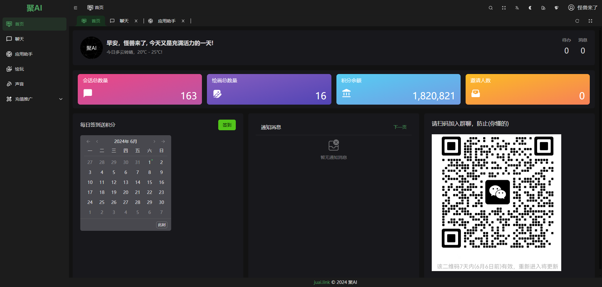
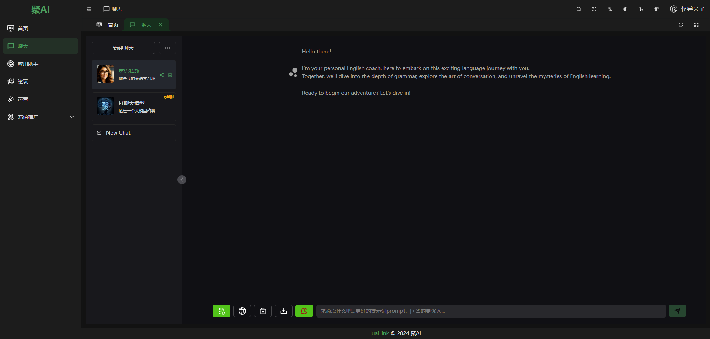
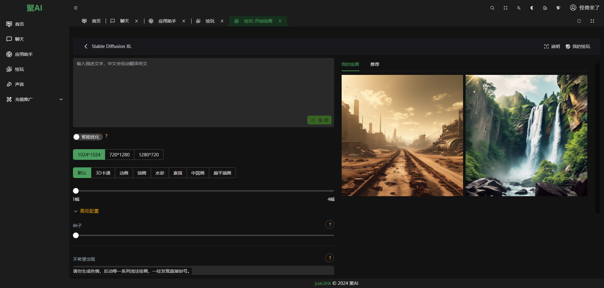
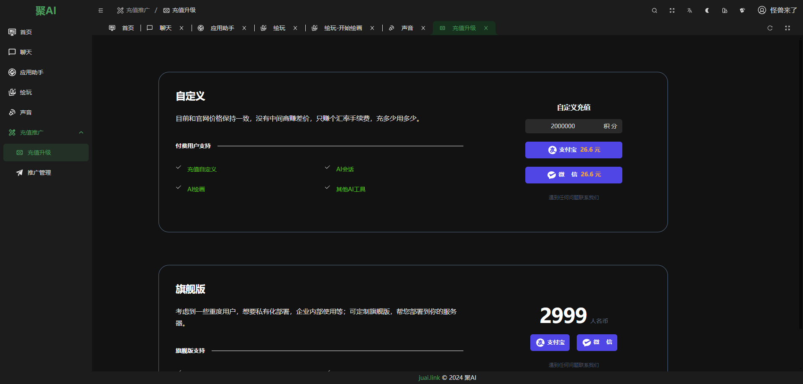

<div align="center">
	
	<h1>聚AI</h1>
</div>
<h2>💛套壳千千万万，没有找到适合我的一种，所以就搞一个，一开始使用chatgpt-web,随着朋友用的越来越多，token消耗就太多，所以就改造了，加一些用户管理，绘画，搜索，语音，视频什么的，后台也把node更换了C#语言开发。</h2>

## 简介

目前【[聚AI](juai.link)】(https://juai.link) 一款集成了主流大语言模型以及绘图模型的网站,也支持支付充值功能，直接运营，支持以下功能：

- 支持 OpenAI 的 GPT-3.5，GPT-4 大语言模型
- 支持 Anthropic 的 Claude instant，Claude 2.1 大语言模型
- 支持 Google 的 Gemini Pro 以及视觉大语言模型
- 支持国产模型：通义千问，文心一言，讯飞星火，商汤日日新，腾讯混元，百川53B，360智脑，天工，智谱，月之暗面等
- 支持开源大模型：Yi 34B，Llama2，ChatGLM2，AquilaChat 7B，Bloomz 7B，轩辕 70B，ChatLaw，Mixtral 等，后续还将开放更多
- 支持文生图、图生图、超分辨率、黑白图片上色、艺术字、艺术二维码等功能，支持 SDXL 1.0、Dall·E 3 等

[`聚AI网站`](https://juai.link) 是一个清新优雅、高颜值且AI功能集成完善的一个平台，基于最新的前端技术栈，包括 Vue3, Vite5, TypeScript, Pinia 和 UnoCSS，为您提供了一站式的AI集成管理解决方案，无需额外配置，开箱即用。同样是一个快速学习前沿技术的最佳实践。

## 技术特性
- **前沿技术应用**：采用 Vue3, Vite5, TypeScript, Pinia 和 UnoCSS 等最新流行的技术栈。
- **清晰的项目架构**：采用 pnpm monorepo 架构，结构清晰，优雅易懂。
- **严格的代码规范**：遵循代码规范，集成了eslint, prettier 和 simple-git-hooks，保证代码的规范性。
- **TypeScript**： 支持严格的类型检查，提高代码的可维护性。
- **丰富的主题配置**：内置多样的主题配置，与 UnoCSS 完美结合。
- **内置国际化方案**：轻松实现多语言支持。
- **自动化文件路由系统**：自动生成路由导入、声明和类型。更多细节请查看 [Elegant Router](https://github.com/soybeanjs/elegant-router)。
- **灵活的权限路由**：同时支持前端静态路由和后端动态路由。
- **丰富的页面组件**：内置多样页面和组件，包括403、404、500页面，以及布局组件、标签组件、主题配置组件等。
- **命令行工具**：内置高效的命令行工具，git提交、删除文件、发布等。
- **移动端适配**：完美支持移动端，实现自适应布局。

## 部分示例图片







## 使用

**环境准备**

确保你的环境满足以下要求：

- **git**: 你需要git来克隆和管理项目版本。
- **NodeJS**: >=18.0.0，推荐 18.19.0 或更高。
- **pnpm**: >= 8.0.0，推荐 8.14.0 或更高。

**克隆项目**

```bash
git clone https://github.com/guipie/juai-web.git
```

**安装依赖**

```bash
pnpm i
```
> 由于本项目采用了 pnpm monorepo 的管理方式，因此请不要使用 npm 或 yarn 来安装依赖。

**启动项目**

```bash
pnpm dev
```

**构建项目**

```bash
pnpm build
```

## 如何贡献

我们热烈欢迎并感谢所有形式的贡献。如果您有任何想法或建议，欢迎通过提交 [pull requests](https://github.com/guipie/juai-web/pulls) 或创建 GitHub [issue](https://github.com/guipie/juai-web/issues/new) 来分享。

## Git 提交规范

本项目已内置 `commit` 命令，您可以通过执行 `pnpm commit` 来生成符合 [Conventional Commits](conventionalcommits) 规范的提交信息。在提交PR时，请务必使用 `commit` 命令来创建提交信息，以确保信息的规范性。


## 浏览器支持

推荐使用最新版的 Chrome 浏览器进行开发，以获得更好的体验。

| [](http://godban.github.io/browsers-support-badges/) | [](http://godban.github.io/browsers-support-badges/) | [](http://godban.github.io/browsers-support-badges/) | [](http://godban.github.io/browsers-support-badges/) | [](http://godban.github.io/browsers-support-badges/) |
| --- | --- | --- | --- | --- |
| not support | last 2 versions | last 2 versions | last 2 versions | last 2 versions |

## 开源作者
[聚AI](https://github.com/guipie)

基于[Soybean](https://github.com/honghuangdc)和[chatgpt-web
](https://github.com/Chanzhaoyu/chatgpt-web)开发，万分感谢。

## 贡献者

感谢以下贡献者的贡献。如果您想为本项目做出贡献，请参考 [如何贡献](#如何贡献)。


## 交流

`聚AI` 是完全开源免费的项目，在帮助开发者更方便地进行中大型管理系统开发，同时也提供微信和 QQ 交流群，使用问题欢迎在群内提问。

## 开源协议

项目基于 [MIT © 2021 juai.link](./LICENSE) 协议，仅供学习参考，商业使用请保留作者版权信息，作者不保证也不承担任何软件的使用风险。
